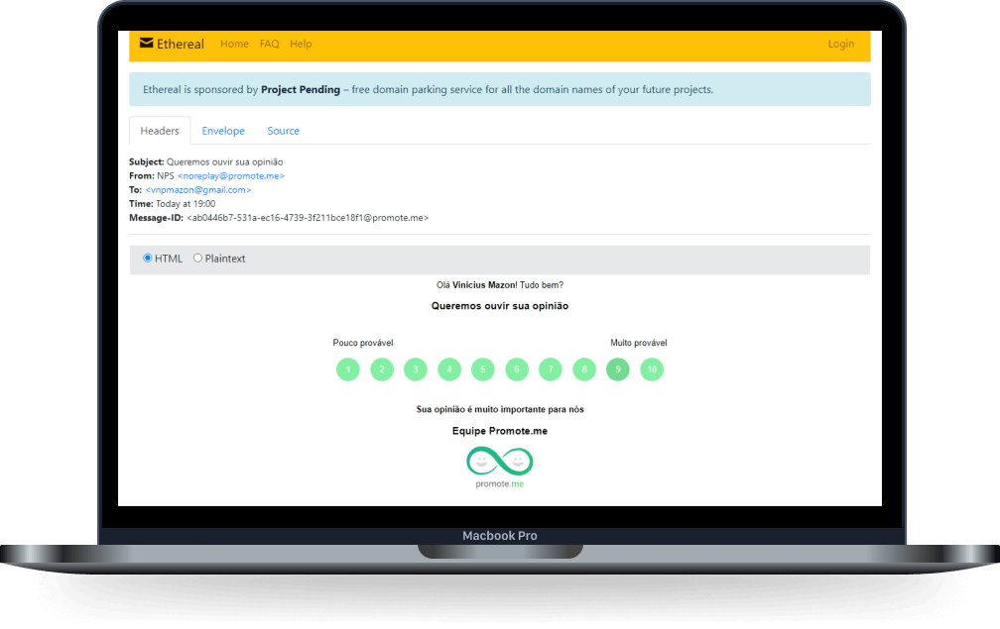

<h1 align="center">
  
</h1>
<p align="center">
  <a href="#-sobre-o-projeto">Sobre o projeto</a>&nbsp;&nbsp;&nbsp;|&nbsp;&nbsp;&nbsp;
  <a href="#-construído-utilizando">Construído utilizando</a>&nbsp;&nbsp;&nbsp;|&nbsp;&nbsp;&nbsp;
  <a href="#-como-utilizar">Como utilizar</a>&nbsp;&nbsp;&nbsp;|&nbsp;&nbsp;&nbsp;
  <a href="#-como-contribuir">Como contribuir</a>&nbsp;&nbsp;&nbsp;|&nbsp;&nbsp;&nbsp;
  <a href="#-licença">Licença</a>
</p>
<div align="center">
    <p>
<a href="https://github.com/ViniciusMazon/nlw4-net-promoter-score/blob/develop/LICENSE"></a>        
</p>
</div>

</br>
</br>

# 💡 Sobre o projeto (Em desenvolvimento)

Net Promoter Score (NPS) é uma métrica de satisfação dos clientes. Clientes muito satisfeitos tem uma grande probabilidade de se tornarem promotores de um produto ou serviço, indicando-o a amigos e familiares.

O NPS é calculado por meio da fórmula: (promotores - detratores) / total de usuários, sendo os promotores os usuários que responderam a pesquisa dando uma nota entre 9 e 10,  os detratores os que deram notas entre 0 e 6. Usuários que responderam com uma nota entre 7 e 8 são considerados passivos.

O Promote.me é uma API que envia pesquisas de satisfação para o e-mail dos usuários cadastrados e calcula o NPS com base nas respostas.

Desenvolvido durante a NLW#4, créditos a [Rocketseat 🚀](https://github.com/Rocketseat)

</br>
</br>

<p align="center">
  
</p>


# 🔬 Construído utilizando

- [NodeJs](https://nodejs.org/en/)

- [TypeScript](https://www.typescriptlang.org)

- [TypeORM](https://typeorm.io/#/)

- [SQLite](https://www.sqlite.org/index.html)

- [Jest](https://jestjs.io)

- [Supertest](https://www.npmjs.com/package/supertest)

- [Nodemailer](https://nodemailer.com/about/)

- [Handlebars](https://handlebarsjs.com/guide/#what-is-handlebars)

- [Commitizen](https://github.com/commitizen/cz-cli)

- [GitFlow](https://github.com/nvie/gitflow)

  </br>

  </br>

# ⚙️ Como utilizar

Clone o repositório:

```bash
git clone https://github.com/ViniciusMazon/nlw4-net-promoter-score.git
```

Instale as dependência rodando, individualmente em cada diretório (api, web e mobile), o comando:

```
yarn
```

Rode as migrations utilizando o script:

```
yarn typeorm migration:run
```

Rode a API utilizando o script:

```
yarn dev
```

Rode os tests utiliando o script:

```  
yarn test
```

</br>

# 🖖🏻 Como contribuir

- Faça um fork desse repositório;
- Clone esse repositório em sua máquina: `https://github.com/ViniciusMazon/nlw4-net-promoter-score.git`
- Cria uma branch com a sua feature: `git checkout -b minha-feature`;
- Faça o commit dos testes: `git commit -m 'test: Nome do teste'`;
- Faça commit das suas alterações: `git commit -m 'feat: Minha nova feature'`;
- Faça push para a sua branch: `git push origin minha-feature`.

Depois que o merge da sua pull request for feito, você pode deletar a sua branch.

</br>

# 📃 Licença

Esse projeto está sob a licença MIT. Veja o arquivo LICENSE para mais detalhes.

---

Feito com 🖤 por Vinicius Mazon.
